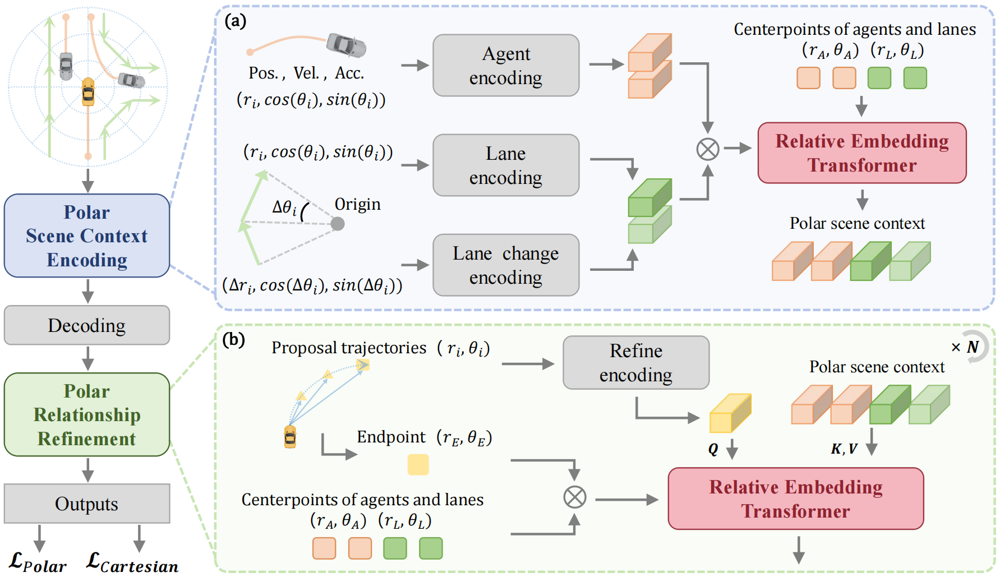

# Relative Position Matters: Trajectory Prediction and Planning with Polar Representation
### [[Paper]](https://arxiv.org/abs/XXXX)

> [**Relative Position Matters: Trajectory Prediction and Planning with Polar Representation**](https://arxiv.org/abs/XXXX)            
> [Bozhou Zhang](https://zbozhou.github.io/), [Nan Song](https://scholar.google.com/citations?hl=zh-CN&user=wLZVtjEAAAAJ), [Bingzhao Gao](https://scholar.google.com/citations?user=GvK2l7sAAAAJ&hl=zh-TW&oi=ao), [Li Zhang](https://lzrobots.github.io)  
> **arXiv 2025**

## Abstract
Trajectory prediction and planning in autonomous driving are highly challenging due to the complexity of predicting surrounding agents' movements and planning the ego agent's actions in dynamic environments. Existing methods encode map and agent positions and decode future trajectories in Cartesian coordinates. However, modeling the relationships between the ego vehicle and surrounding traffic elements in Cartesian space can be suboptimal, as it does not naturally capture the varying influence of different elements based on their relative distances and directions. To address this limitation, we adopt the Polar coordinate system, where positions are represented by radius and angle. This representation provides a more intuitive and effective way to model spatial changes and relative relationships, especially in terms of distance and directional influence. Based on this insight, we propose **Polaris**, a novel method that operates entirely in Polar coordinates, distinguishing itself from conventional Cartesian-based approaches. By leveraging the Polar representation, this method explicitly models distance and direction variations and captures relative relationships through dedicated encoding and refinement modules, enabling more structured and spatially aware trajectory prediction and planning. Extensive experiments on the challenging prediction (Argoverse 2) and planning benchmarks (nuPlan) demonstrate that Polaris achieves state-of-the-art performance. 

## Pipeline
<div align="center">
  
</div><br/>

## News
- 2025.08, the paper is released on arXiv, and the code will be made publicly available upon acceptance.

## BibTeX
```bibtex
@article{zhang2025polaris,
 title={Relative Position Matters: Trajectory Prediction and Planning with Polar Representation},
 author={Zhang, Bozhou and Song, Nan and Gao, Bingzhao and Zhang, Li},
 journal={arXiv preprint},
 year={2025},
}
```